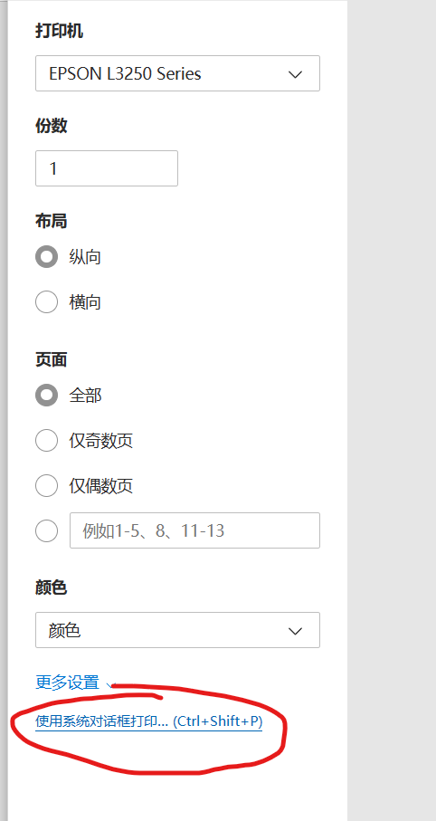
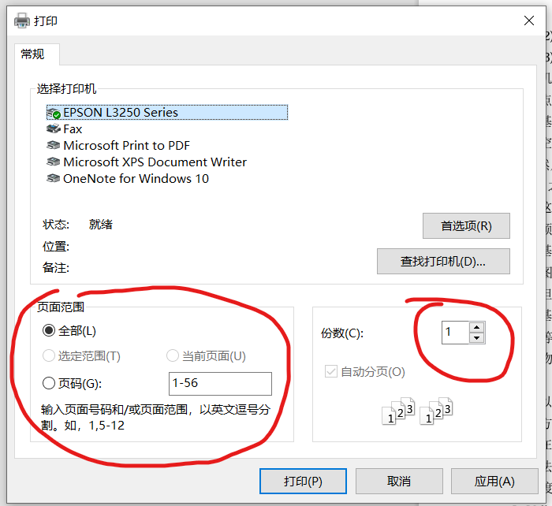
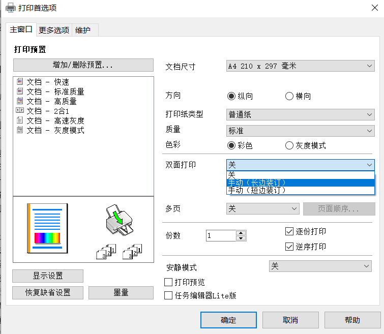

# 打印机使用方法

## 防止 Windows 自动断开无网络的 wifi

请参考下面网页

注意：网页中的组策略方法和注册表方法干的是同一件事，选一个做就行了

[禁止Windows自动断开没网的wifi - DayDayUp - HYLUZ](https://www.hyluz.cn/post/55143.html)

## 卸载系统自带驱动

打开设置-设备-打印机和扫描仪，删除类似于 EPSON L3250 Series 的设备

## 安装驱动

驱动下载页面：[服务与支持页面_驱动下载_耗材选件 - 爱普生中国 (epson.com.cn)](https://www.epson.com.cn/services/supportproduct.html?p=54ac0d25a9f8490294c6ae7a9f8bd77d&tab=1)

下载打印机驱动程序 64 位，和扫描仪驱动程序（只有需要扫描时用）

连上打印机wifi后安装驱动

打印机wifi：DIRECT-3C-EPSON-1316DA

密码：14210800

## 打印方法

选择打印机后，选择使用系统对话框打印（这个页面的其他设置不要动）：

在下面的窗口中选择打印范围和打印份数（不要在上面的页面中选择）

（可选）在上面的窗口点击首选项，然后在下面的窗口选择双面打印：手动（长边装订）和色彩、质量、安静打印模式等参数

点击确定

点击打印

双面打印时，把打印了一半的纸整体放入进纸口，使得有字的面朝下，页首朝进纸口。

## 错误处理

### 中断打印

要中断打印请按打印机上的三角形魔法阵按钮

### 有多个相同的打印机

在设置-设备-打印机和扫描仪中，检查那些相同的打印机。

点进其中一个的管理-打印首选项

如果出现了和 `打印方法` 部分相同的窗口，则这个打印机是正确驱动对应的打印机

然后把其他错误驱动的打印机删除
