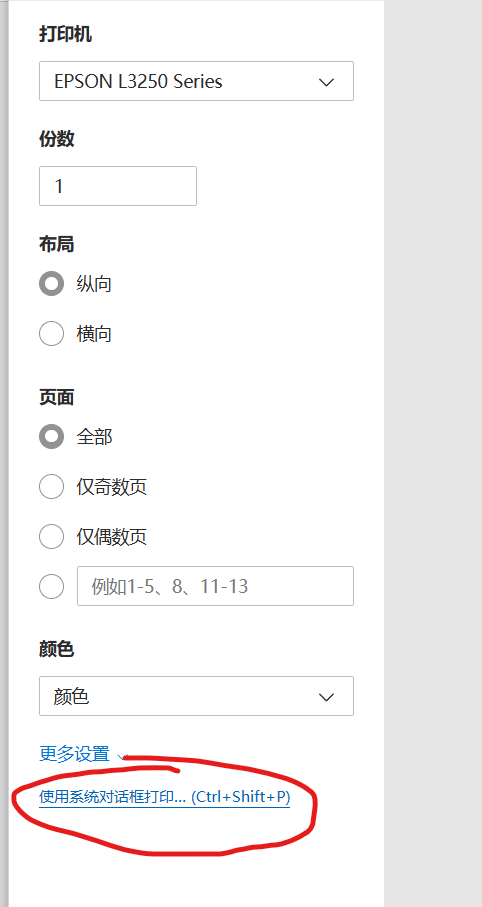
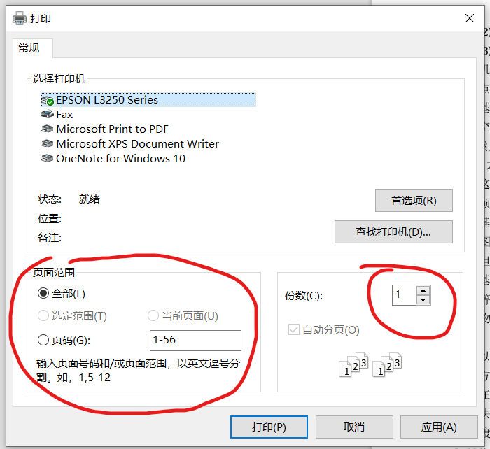
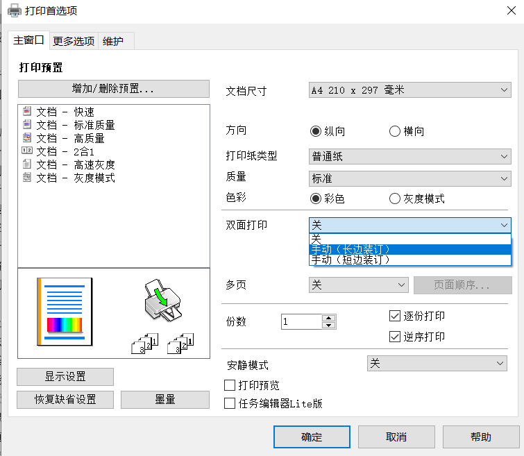

# 打印机使用方法

## 安装驱动

不要使用系统自动安装的驱动（很烂）

驱动下载页面：[服务与支持页面_驱动下载_耗材选件 - 爱普生中国 (epson.com.cn)](https://www.epson.com.cn/services/supportproduct.html?p=54ac0d25a9f8490294c6ae7a9f8bd77d&tab=1)

下载打印机驱动程序 64 位，和扫描仪驱动程序（只有需要扫描时用）

连上打印机wifi后安装驱动

打印机wifi：DIRECT-3C-EPSON-1316DA

密码：14210800

## 打印方法

选择打印机后，选择使用系统对话框打印（这个页面的其他设置不要动）：

在下面的窗口中选择打印范围和打印份数（不要在上面的页面中选择）

（可选）在上面的窗口点击首选项，然后在下面的窗口选择双面打印：手动（长边装订）和色彩、质量、安静打印模式等参数

点击确定

点击打印

双面打印时，把打印了一半的纸整体放入进纸口，使得有字的面朝下，页首朝进纸口。

## 错误处理

要中断打印请按打印机上的三角形魔法阵按钮
